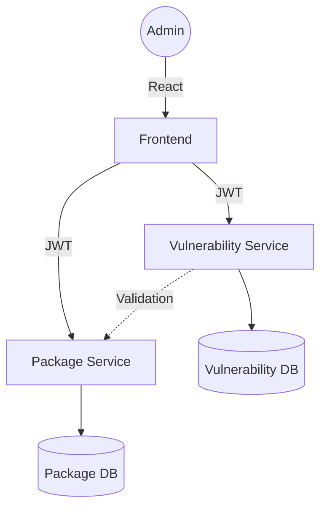

# 🛡️ Microservices Vulnerability Tracker

A production-ready, distributed system for tracking package vulnerabilities and security risks. Built with a modern microservices architecture and a high-performance React dashboard.


---

## 🏗️ Architecture Overview

The project is split into 5 core components for maximum scalability and service isolation:

1.  **Package Service**: Manages asset metadata and version tracking.
2.  **Vulnerability Service**: Handles CVE recording and risk score calculations.
3.  **Frontend Dashboard**: Premium glassmorphic UI for real-time security telemetry.
4.  **Package Database**: Dedicated PostgreSQL instance for asset data.
5.  **Vulnerability Database**: Dedicated PostgreSQL instance for security records.



---

## ✨ Key Features

*   **Glassmorphic UI**: A modern, interactive dashboard with real-time risk feedback.
*   **Dynamic Risk Scoring**: Proprietary algorithm calculating risk based on Average CVSS and manual severity weighting.
*   **Inter-Service Communication**: Secure validation of package existence across microservice boundaries.
*   **JWT Authentication**: Stateless, production-grade security for administrative actions.
*   **One-Click Deployment**: Fully orchestrated via Docker Compose and Render Blueprints.

---

## 🚀 Getting Started

### Local Setup (Development)
Ensure you have **Docker Desktop** installed, then run:

```bash
docker-compose up --build
```
Access the dashboard at: `http://localhost:3000`  
**Credentials**: `admin` / `admin`

### Cloud Deployment (Render)
This project is configured with a `render.yaml` blueprint for instant deployment:
1.  Connect this repository to [Render.com](https://render.com).
2.  Create a new **Blueprint Instance**.
3.  The databases and backends will spin up automatically.

---

## 🏗️ Technology Stack

*   **Backend**: Python, FastAPI, Asyncpg, PostgreSQL.
*   **Frontend**: React 18, Vite, Lucide-React.
*   **DevOps**: Docker, Docker Compose, Render Blueprints.
*   **Design**: Glassmorphism, CSS Variables, Responsive Layouts.

---

## 👥 Authors
*   **Ruthvik-mt** - [GitHub](https://github.com/ruthvik-mt)

---
*Created for secure-by-default software management.*
